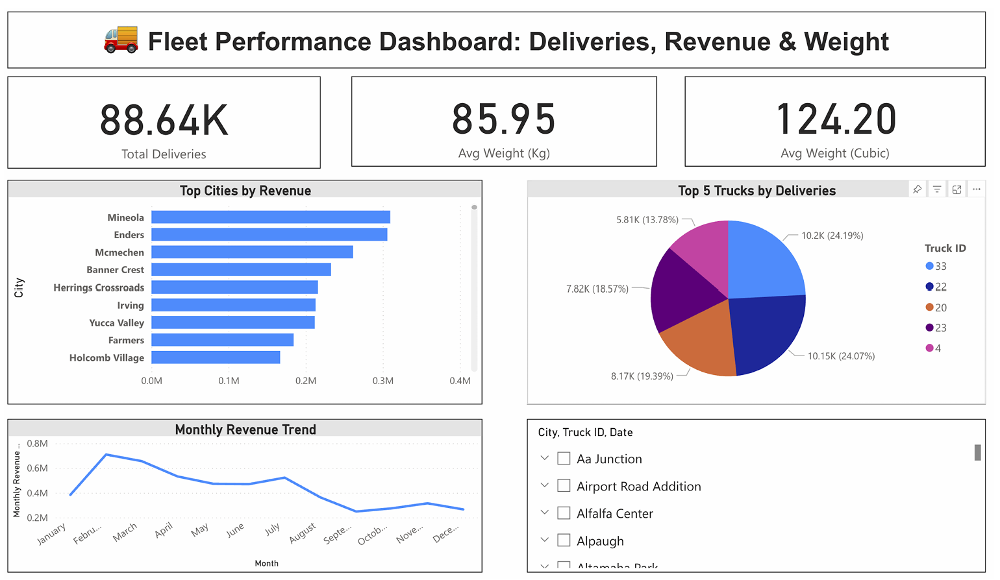

## 🚚 Fleet Performance Dashboard

This project analyzes logistics delivery data to uncover trends, performance metrics, and operational bottlenecks.  
We used Python for data cleaning, SQL for querying metrics, and Power BI for building an interactive dashboard.

---
## 📸 Dashboard Preview




## 📌 Overview

The goal was to build a dashboard that helps logistics managers track:
- Total deliveries
- Revenue trends
- Truck utilization
- Delivery weights by type

---

## 🧰 Tools Used

`Python` · `Pandas` · `SQL (BigQuery)` · `Power BI`

---

## ✅ Key Tasks

- Cleaned and transformed delivery data using Python (Pandas)
- Created SQL queries to calculate key KPIs: deliveries, revenue, weight averages, city-wise performance
- Built an interactive Power BI dashboard for business users
- Highlighted operational insights like top-performing trucks and peak delivery months

---


## 💡 Sample Insights

- Truck #22 completed the most deliveries  
- Bloom city generated the highest revenue  
- Summer months showed a 12% spike in delivery volume  
- Average load weight: 450 kg and 2.3 cubic meters

---

## 🧠 Business Impact

> This dashboard enables the logistics team to monitor performance, plan capacity, and make data-driven routing decisions.

---

## 📂 Files Included

- `Fleet_Management.ipynb` – Python cleaning notebook  
- `fleet_dashboard_queries.sql` – SQL queries used in dashboard  
- `fFreight.csv` – cleaned logistics dataset
- `dashboard_preview.png` – Power BI screenshot  

---

## ▶️ Run the Notebook

```bash
pip install pandas
